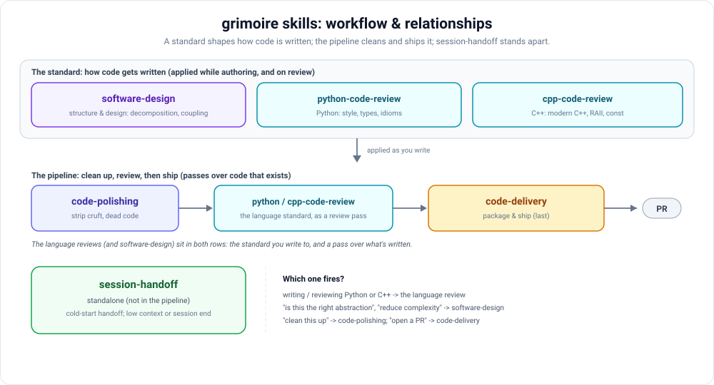

# grimoire

A personal collection of reusable artifacts for working with large language models — skills, prompts, agent definitions, and snippets. Provider-neutral: nothing here is tied to a single model or vendor.

## Layout

| Directory | What lives here |
|-----------|-----------------|
| `skills/` | Self-contained skills — a folder per skill, each with its own instructions and any supporting files. |
| `prompts/` | Standalone prompts and prompt templates. |
| `agents/` | Agent definitions: role, tools, and behavior. |
| `snippets/` | Small reusable fragments — system blurbs, formatting rules, few-shot examples. |

## How the skills relate

The code skills form a short pipeline — clean up the content, optionally run a language-specific style pass, then package and ship — plus one standalone skill for session handoffs.

- **`code-polishing`** — language-agnostic content cleanup: strip iteration artifacts, dead code, stale docs, encapsulation and naming drift. Runs first.
- **`python-code-review` / `cpp-code-review`** — the language-specific style pass (PEP 8, typing, idioms / clang-format, modern C++). Optional, picked by language.
- **`code-delivery`** — packages and ships whatever change exists: commit and PR text plus git operations in Claude Code, or inline/zip packaging on Claude.ai. Runs last, and owns the commit/PR conventions the others defer to.
- **`session-handoff`** — standalone: writes a cold-start handoff document at the end of a session. Not part of the code-change pipeline.

Which one fires: "clean this up" / "PR-ready" → `code-polishing`; "add type hints" / "modernize" → the language review; "fix this" / "open a PR" → `code-delivery`.

## Using an artifact

Each artifact is self-describing. Open its folder (or file) and read the heading — it states what the artifact does, what it expects as input, and how to drop it into your own setup. Copy what you need; there's no install step and no runtime to wire up.

## Adding an artifact

1. Pick the directory that fits.
2. For a skill, create a new folder with a `SKILL.md` describing it; keep supporting files alongside it.
3. For everything else, a single well-named Markdown file is enough.
4. Keep it portable — avoid hard dependencies on one provider's API or model names.

## License

[MIT](LICENSE) — use it freely.
